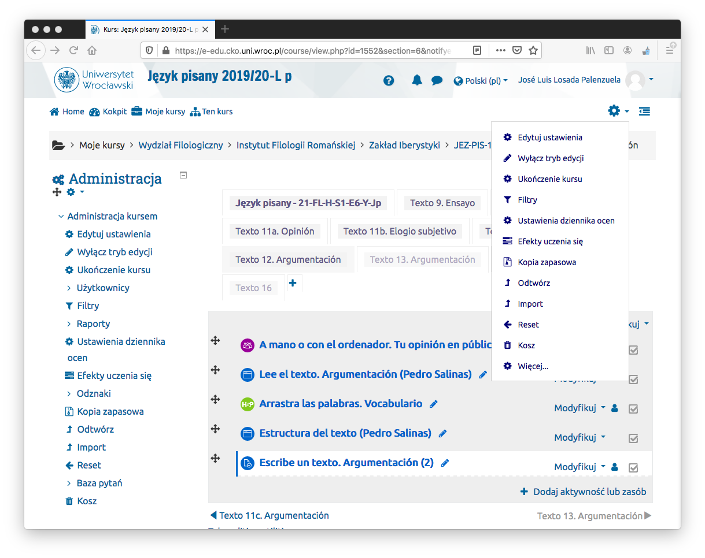
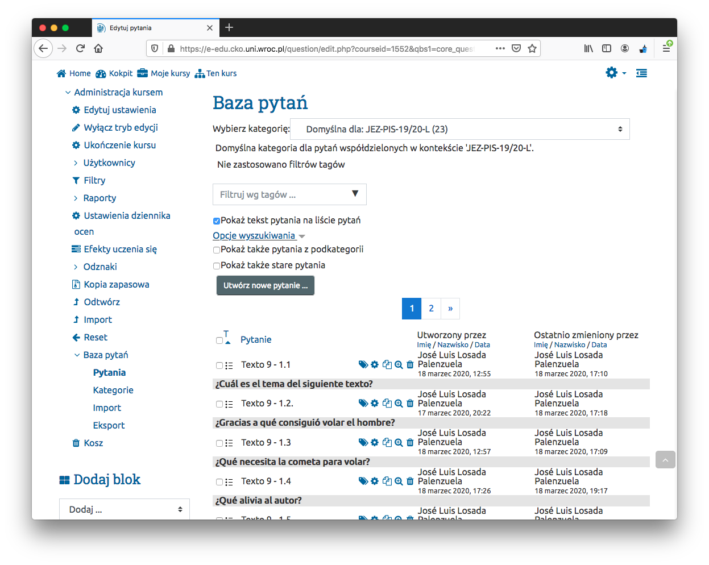
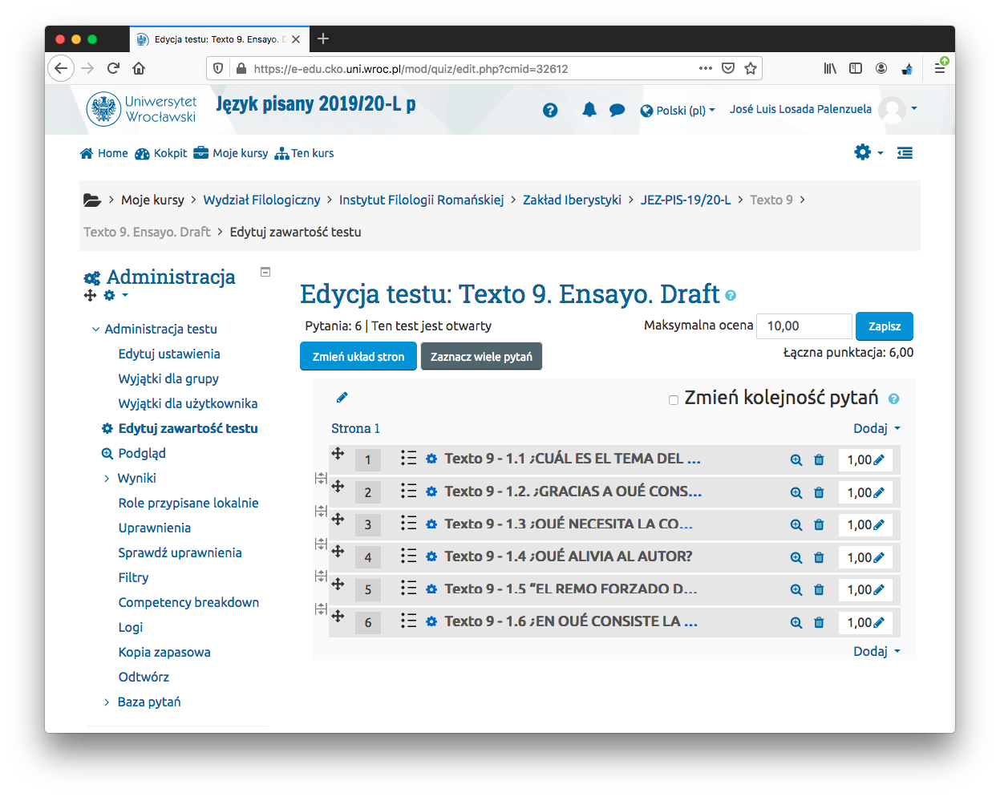
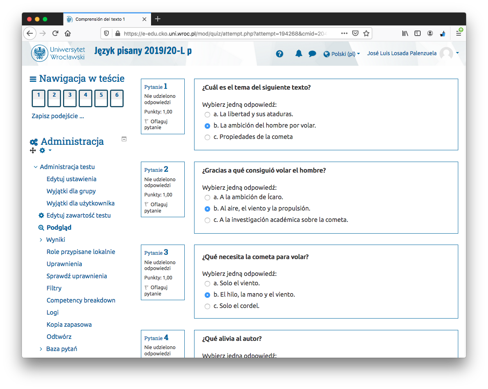
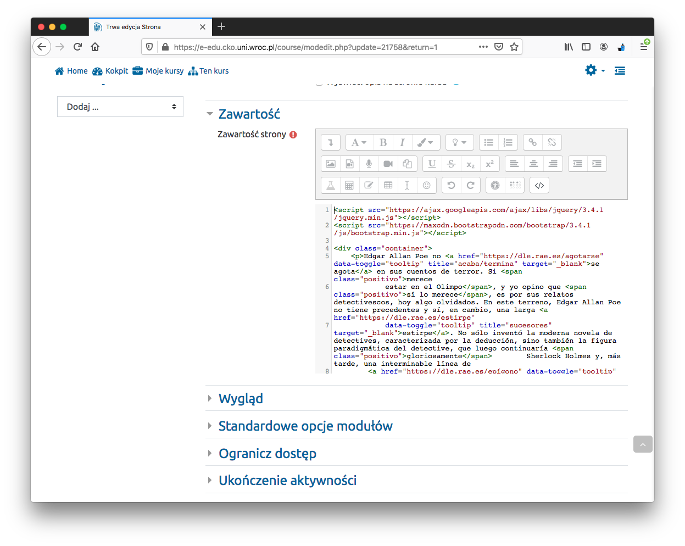
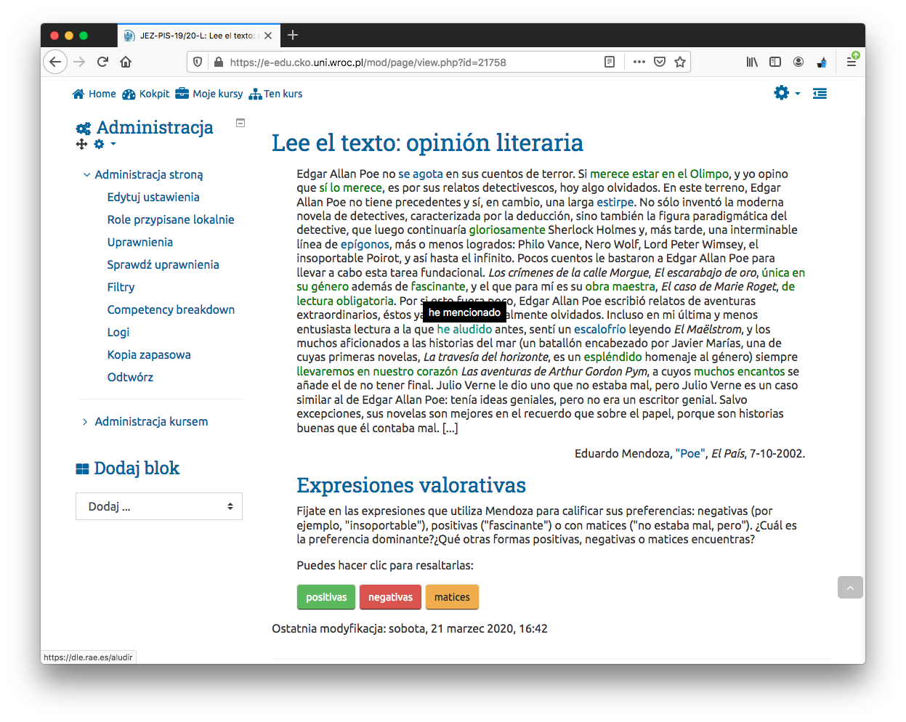
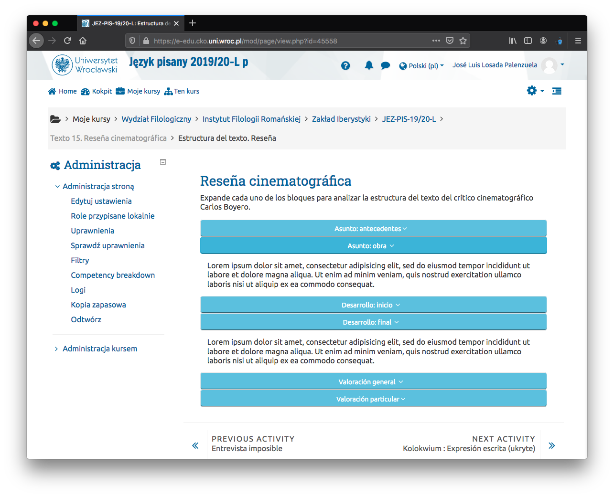
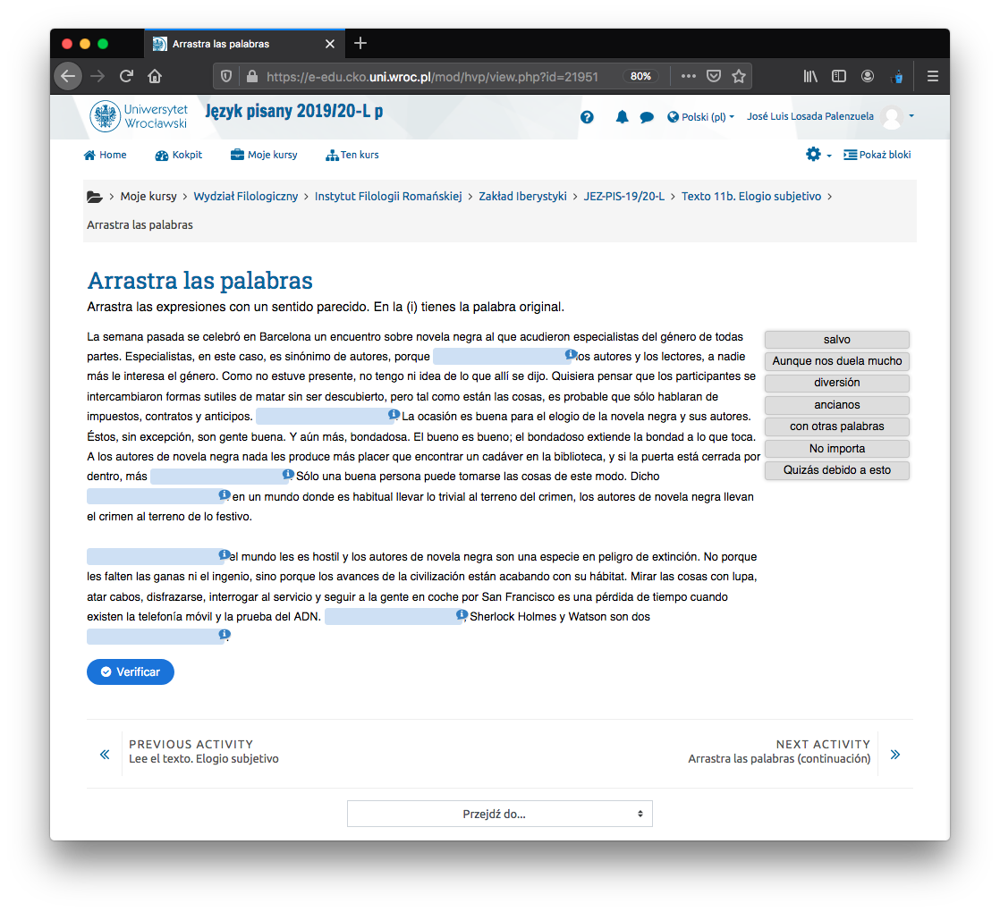
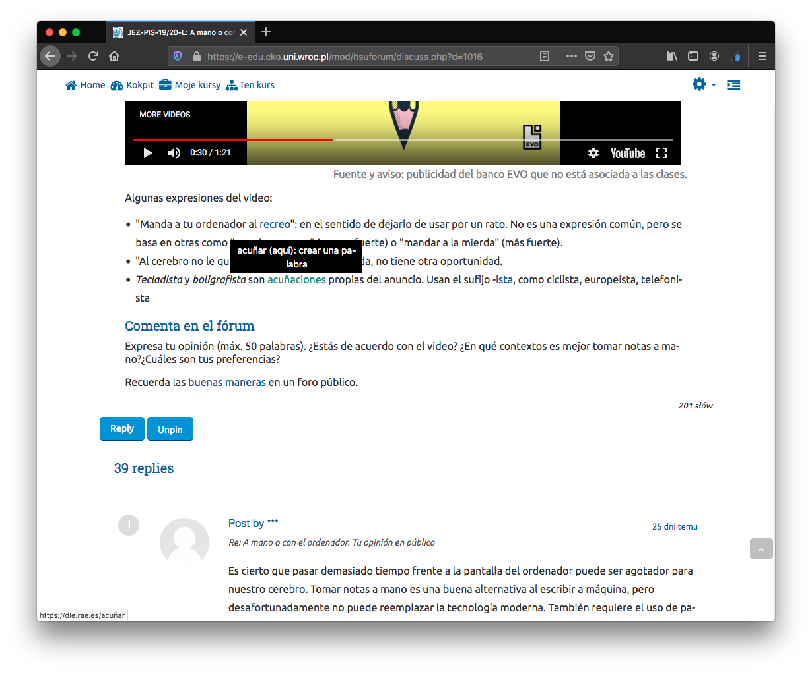
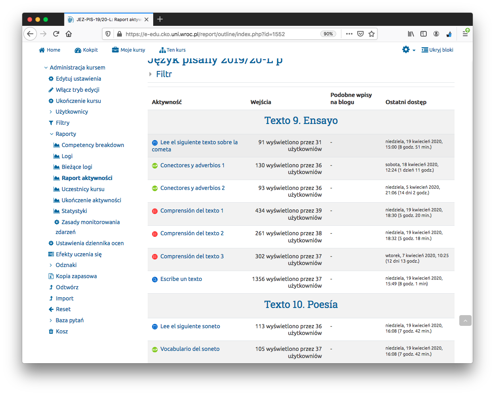

```{r load_packages, message=FALSE, warning=FALSE, include=FALSE}
library(fontawesome)
# icons adding `r fa("plus", fill = "#1177d1")`
```

Własna dokumentacja dla przegotowania (nagłej) lekcji Moodla

# Otworzenie kursu przez CKO

1. Mail do <cko@uwr.edu.pl> z informację:

- *nazwę przedmiotu*: __
- *kody USOS przedmiotów*: __
- *podpis zawierający nazwę Wydział/Instytut/Zakład*: __ 

2. Link do kursu : <https://e-edu.cko.uni.wroc.pl/course/view.php?id=1552>

3. Optional (n.p., nowy klucz): Administracja kursem > Użytkownicy > Metody zapisów.

4. Wysłać e-mail studentom z linkiem i hasłem via USOS.

#  Dodawać, modyfikować, zmienić!

- Administracja kursem > Wyłącz tryb edycji == Menu akcji `r fa("cog", fill = "#1177d1")` > Wyłącz tryb edycji

# Dodawanie *Topic*

tzn. lekcja/spotkanie/zajęcia

- `r fa("plus", fill = "#1177d1")` (tab) Zwiększ liczbę sekcji > Modyfikuj > `r fa("cog", fill = "#1177d1")` Edytuj sekcję
- `r fa("check-circle", , fill = "#1177d1")` Własna nazwa
- Streszczenie: na razie dwa słowa o tego spotkania albo nic. Struktura czynności jest self-explanatory. Z czasem więcej...

Tip! `r fa("lightbulb",fill="tomato")` Wyłącz tryb edycji > Modyfikuj > Hide topic . Topic jest niewidoczny dla studenta (np., podczas utworzenia nowego Topic, spróbowania czegos nowego, itd.) 

# Ogólna struktura mojej lekcji (w *Topic*)

Przykład treści lekcji, która została wymyślona dla każdej lekcji. Każda lekcja może składać się z całości lub tylko części:

- Tekst do czytania
- Ćwiczenia: 
    - Fill gaps
    - drag words
    - check words
    - ...
- Pytania do tekstu 
- Pisanie tekstów
- Forum
- Sprawdzian

Aktywność domyślna z Moodla używana do każdej treści 

- Tekst do czytania: `strona` 
- Ćwiczenia: `Interactive Content` (`HP5 activity`) 
    - Fill gaps
    - drag words
    - check words
    - ...
- Pytania do tekstu: `Test (Quiz)` 
- Pisanie tekstów: `zadanie`  
- Forum: `forum` 
- Sprawdzian: `Test (Quiz)` 

<p align="center">
  
</p>
**Dodawanie aktywności**

- w *Topic*: `r fa("plus", fill = "#1177d1")` Dodaj aktywność lub zasób.

## Pytania do tekstu `Test (Quiz)` 

Tekst do czytania nie będzie na stronie, na której znajdują się pytania.

1. Pytania muszą zostać najpierw utworzone. Lepiej utworzyć zestaw pytań **dostępne dla całego kursu!** i zapisać je w tzw. `Baza pytań`.

- Administracja kursem > Baza pytań > utwórz nowe pytanie
2.  Wybierz rodzaj pytania: n.p.  `Wybór wielokrotny`
- Nazwa pytania: ważny! nazwa, która dobrze identyfikuje pytanie w kursie: **Texto 9 - 1.1** , tzn:  Topic (**Texto 9**) - zewstaw pytań(**1**) . NumPytania(**1**) (w tym sposób mogę je potem lepiej zidentyfikować na liście).
- Treść pytania: wpisz pytania! `¿Cuál es el tema del siguiente texto?`
- Wymieszaj odpowiedzi (niezaznaczone)
- Odpowiedzi: 
    - Wybór 1: wpisz odpowiedź! `La libertad y sus ataduras`
         - Ocena: 100%  <- poprawna odpowiedź.
    - Wybór 2: wpisz odpowiedź! `La ambición del hombre por volar`
         - Ocena: Żaden
    - ...
- **almost done!** (zapisz zmiany)

<p align="center">
  
</p>

Tip! `r fa("lightbulb",fill="tomato")` Po utworzeniu pytania można je duplikować  i używać ponownie utworzonej struktury.  Baza pytań > `r fa("copy")` duplikuj.

- Extra stuff:
    - Pole do pytań i odpowiedzi jest edytorem HTML, więc można dodać, n.p., link do słownika, obraz itd.
    - Informacja zwrotna: dodawania wyjaśnienie 
4. Dodawania pytania w *Topic*

- Dodawanie Topic (vide supra) > `r fa("plus", fill = "#1177d1")` Dodaj aktywność lub zasób > Test (Quiz)
    - Nazwa: n.p. `Comprensión del texto 11c`
    - Układ: ~ Nowa strona co 10 pytań 
    - almost done! (zapisz i wyświetl) Nie zmieniam nic innego. Studenci mogą podejść w dowolnym momencie i dowolna ilość razy.
    - Pytania do Test (Quiz): `r fa("cog", fill = "#1177d1")` Edytuj zawartość testu > dodaj > `r fa("plus", fill = "#1177d1")` z bazy pytań
    - zapisz `Łączna punktacja` do `Maksymalna ocena` (każde pytanie 1 punkt)
    - **done!**


<p align="center">
  
</p>

<p align="center">
  
</p>

5. Inne

  - Na razie używam z bazy pytań jeszcze Prawda/Fałsz. Dla innego typu pytań, HP5 activity.
  - Używać `Test (Quiz)` do kolokwium z ustaloną datę, itd. (documentation to be done)
    
## Tekst do czytania: `strona` 

- `r fa("plus", fill = "#1177d1")` Dodaj aktywność lub zasób > Strona
- Ogólne ~ Nazwa `Lee el texto. Argumentación (Pedro Salinas)`. Lepiej używać nazwę, która dobrze identyfikuje tekst w kursie.
- Wygląd (wszystkie możliwości niezaznaczone)
- Zawartość: wpisz tekst.
- **done!**

### Extra (fancy) stuff  

Tego nie ma *out of the box* na platformie Moodle, to jest **html & javascript** własnej produkcji. 

Interfejs `Zawartość strony` jest zwykłym edytorem HTML. Nie pozwala na dodawanie stylów do dokumentu przez element `<link rel="stylesheet"...`, ale można dodać CSS bezpośrednio w elementach `<p style="text-align: right">`; 
    
Natomiast edytor pozwala na dodawanie JavaScript przez `<script>` oraz bezpośrednio. 

Ta wersja Moodle zawiera domyślny **Bootstrap**!, więc można używać atrybutów, n.p., `<button class="btn btn-info btn-sm">Tesis: planteamiento</button>`.

- Na pasek narzędzi edytora HTML: `r fa("level-down-alt", fill = "grey")` Pokaż/ukryj zaawansowane przyciski > `r fa("code", fill = "grey")` Edytor HTML

- Administracja kursem > Filtry > czysty HTML: wyłączony. Ale i tak uzuwa `<head>`, `<body>`, itd.

- Copy & paste stronę utworzoną z html + js (bezpozrednio z Sublime n.p.). Edytor usunie wszystkie elementy z header oprócz `<script>`.


1. **Tooltip** (z linkiem do słownika): pokazuje synonim słowa (i linkuje do słownika RAE).

- general JS libraries (Korzystam z tych libraries dla wszystkich przykładów)
    ```{r, eval=FALSE}
      <script src="https://ajax.googleapis.com/ajax/libs/jquery/3.4.1/jquery.min.js"></script>
      
      <script src="https://maxcdn.bootstrapcdn.com/bootstrap/3.4.1/js/bootstrap.min.js"></script>
    ```
- Function
    ```{r, eval=FALSE}
    <script>
    $(document).ready(function(){
      $('[data-toggle="tooltip"]').tooltip();   
    });
    </script>
    ```
- In text
    ```{r, eval=FALSE}
    <p>Edgar Allan Poe no <a href="https://dle.rae.es/agotarse" data-toggle="tooltip" title="acaba/termina" target="_blank">se agota</a> en sus cuentos de terror.
    ```

2. **Click and Highlight** (Może być przydatne do podświetlenia/wyróżnienia części tekstu)

- general JS libraries
    ```{r, eval=FALSE}
      <script src="https://ajax.googleapis.com/ajax/libs/jquery/3.4.1/jquery.min.js"></script>
      
      <script src="https://maxcdn.bootstrapcdn.com/bootstrap/3.4.1/js/bootstrap.min.js"></script>
    ```

- Functions
    ```{r, eval=FALSE}
      <script>
      function matiz() {
        var x = document.getElementsByClassName("matices");
        for (var i = 0; i < x.length; i++) {
      	  if (x[i].style.color == "orange") {
      	    x[i].style.color = "inherit";
      	  } else {
      	    x[i].style.color = "orange";
      	  }
      	}
      }
      
      function negative() {
        var x = document.getElementsByClassName("negativo");
        for (var i = 0; i < x.length; i++) {
      	  if (x[i].style.color == "red") {
      	    x[i].style.color = "inherit";
      	  } else {
      	    x[i].style.color = "red";
      	  }
      	}
      }
      
      function positive() {
        var x = document.getElementsByClassName("positivo");
        for (var i = 0; i < x.length; i++) {
      	  if (x[i].style.color == "green") {
      	    x[i].style.color = "inherit";
      	  } else {
      	    x[i].style.color = "green";
      	  }
      	}
      }
      </script>
    ```

- Buttons
    ```{r, eval=FALSE}
<button class="btn btn-success" onclick="positive()">positivas</button>
<button class="btn btn-danger" onclick="negative()">negativas</button>
<button class="btn btn-warning" onclick="matiz()">matices</button>
    ```

- In text
    ```{r, eval=FALSE}
<span class="positivo">espléndido</span>
    ```

<p align="center">
  
</p>

<p align="center">
  
</p>

3. **Wyświetlić strukturę** (Akordeon wykonany w JS)

- Documentation to be done...

```{r, eval=FALSE}
function conclusion() {
  var x = document.getElementById("conclusion");
	  if (x.style.display == "none") {
	    x.style.display = "block";
	  } else {x.style.display = "none";}
	}
```

<p align="center">
  
</p>


## Ćwiczenia: `HP5 activity` 

- Documentation to be done...
- Interactive Content. Wyniki/oceny są domyślnie wpisane w dzienniku ocen.

<p align="center">
  
</p>

## Pisanie tekstów: `zadanie`  

- `r fa("plus", fill = "#1177d1")` Dodaj aktywność lub zasób > zadanie
- Nazwa zadania: `Escribe un texto. Argumentación (2)`
- Opis: dokladnie deskripcje...
- Dostępność: 
    - Termin oddania: `r fa("check-circle", , fill = "#1177d1")` Włącz
    - Ostateczny termin: `r fa("check-circle", , fill = "#1177d1")` Włącz
- Typy zadań: 
    - tylko: Tekst online    
    - Limit słów: `r fa("check-circle", , fill = "#1177d1")` Włącz  
- Typy odpowiedzi
    - tylko: Komentarz zwrotny `r fa("check-circle", , fill = "#1177d1")` Włącz (razem z) 
    - Komentarz w tekście: TAK


## Forum: `Open Forum` 

- Uwaga, dwa rodzaje forum w Aktywności (> Open Forum)
- Documentation to be done...

<p align="center">
  
</p>

# Raporty, oceny

- Administracja kursem > Raporty > `r fa("chart-area", fill = "#1177d1")` Raport aktywności

<p align="center">
  
</p>

- Check by exercise: Administracja kursem > Ustawienia dziennika ocen > [aktywnosci] > [student | report] .

- Check by student: Administracja kursem > Użytkownicy > Zapisani użytkownicy > [student] > More > Przegląd ocen. 

- Download all in HTML! [zadania] > Zobacz wszystkie zadania > Akcja oceniania > Pobierz wszystkie przesłane zadania:  

# Kokpit `r fa("tachometer-alt", fill = "#1177d1")`

- Nadchodzące wydarzenia, np., zadania


