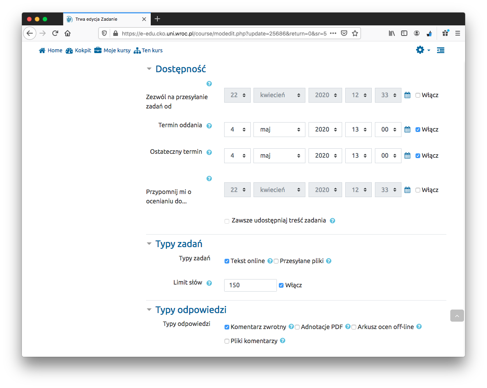
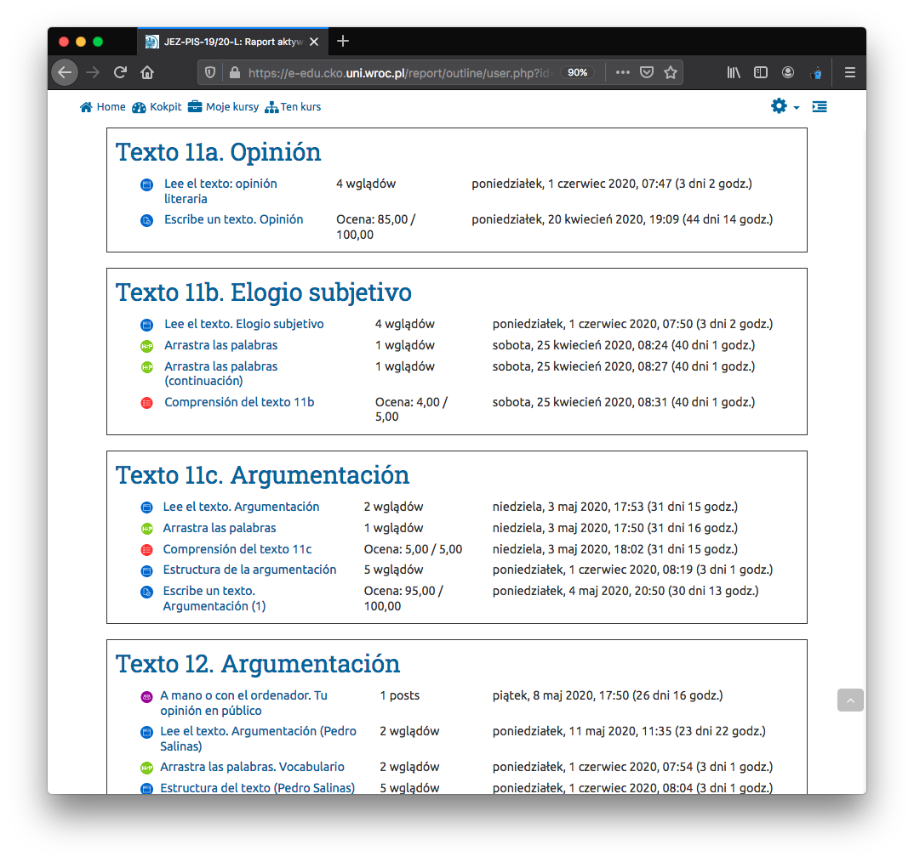
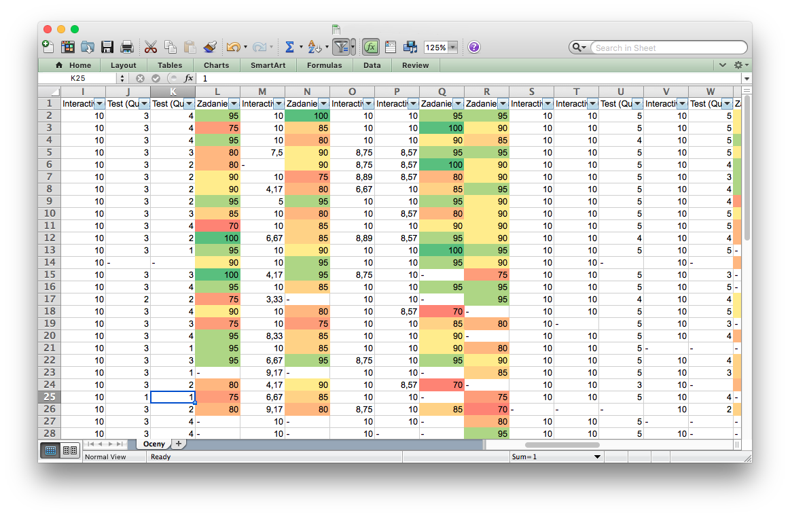

```{r load_packages, message=FALSE, warning=FALSE, include=FALSE}
library(fontawesome)
# icons adding `r fa("plus", fill = "#1177d1")`
```

Własna dokumentacja dla przegotowania (nagłej) lekcji Moodla

# Otworzenie kursu przez CKO

~~1. Mail do cko@uwr.edu.pl z informację:~~

~~- *nazwę przedmiotu*:~~
~~- *kody USOS przedmiotów*:~~
~~- *podpis zawierający nazwę Wydział/Instytut/Zakład*:~~

1. Skontaktować się z <cko@uwr.edu.pl>.

2. Link do kursu : <https://e-edu.cko.uni.wroc.pl/course/view.php?id=1552>

3. Optional (n.p., nowy klucz): Administracja kursem > Użytkownicy > Metody zapisów.

4. Wysłać e-mail studentom z linkiem i hasłem via USOS.

#  Dodawać, modyfikować, zmienić!

- Administracja kursem > Wyłącz tryb edycji == Menu akcji `r fa("cog", fill = "#1177d1")` > Wyłącz tryb edycji
- Administracja kursem > Edytuj ustawienia

# Format kursu: oneTopic format

Układ stron kursu: `oneTopic` to domyślny format, ale zamiast na tematy, można podzielic na cotygodniowe sekcje.

- Administracja kursem > Edytuj ustawienia > Format kursu > onetopic format [default]


# Dodawanie *Topic*

tzn. lekcja/spotkanie/zajęcia, które odbywa się, na przykład, 1 raz w tygodniu.

- `r fa("plus", fill = "#1177d1")` (tab) Zwiększ liczbę sekcji > Modyfikuj > `r fa("cog", fill = "#1177d1")` Edytuj sekcję
- `r fa("check-circle", , fill = "#1177d1")` Własna nazwa
- Streszczenie: na razie dwa słowa o tego spotkania albo nic. Struktura czynności jest self-explanatory. Z czasem więcej...

Tip! `r fa("lightbulb",fill="tomato")` Wyłącz tryb edycji > Modyfikuj > Hide topic . Topic jest niewidoczny dla studenta (np., podczas utworzenia nowego Topic, spróbowania czegos nowego, itd.) 

# Ogólna struktura mojej lekcji (w *Topic*)

Przykład treści lekcji, która została wymyślona dla każdej lekcji. Każda lekcja może składać się z całości lub tylko części:

- Tekst do czytania
- Ćwiczenia: 
    - Fill gaps
    - drag words
    - check words
    - ...
- Pytania do tekstu 
- Pisanie tekstów
- Forum
- Sprawdzian / Kolokwium

Aktywność domyślna z Moodla używana do każdej treści 

- Tekst do czytania: `strona` 
- Ćwiczenia: `Interactive Content` (`HP5 activity`) 
    - Fill gaps
    - drag words
    - check words
    - ...
- Pytania do tekstu: `Test (Quiz)` 
- Pisanie tekstów: `zadanie`  
- Forum: `Open forum` 
- Sprawdzian: `Test (Quiz)` 

<p align="center">
  
</p>
**Dodawanie aktywności**

- w *Topic*: `r fa("plus", fill = "#1177d1")` Dodaj aktywność lub zasób.

## Pytania do tekstu `Test (Quiz)` 

Tekst do czytania nie będzie na stronie, na której znajdują się pytania.

1. Pytania muszą zostać najpierw utworzone. Lepiej utworzyć zestaw pytań **dostępne dla całego kursu!** i zapisać je w tzw. `Baza pytań`.

- Administracja kursem > Baza pytań > utwórz nowe pytanie
2.  Wybierz rodzaj pytania: n.p.  `Wybór wielokrotny`
- Nazwa pytania: ważny! nazwa, która dobrze identyfikuje pytanie w kursie: **Texto 9 - 1.1** , tzn:  Topic (**Texto 9**) - zewstaw pytań(**1**) . NumPytania(**1**) (w tym sposób mogę je potem lepiej zidentyfikować na liście). Update: można dodać "tags" > tagi.
- Treść pytania: wpisz pytania! `¿Cuál es el tema del siguiente texto?`
- Wymieszaj odpowiedzi (niezaznaczone)
- Odpowiedzi: 
    - Wybór 1: wpisz odpowiedź! `La libertad y sus ataduras`
         - Ocena: 100%  <- poprawna odpowiedź.
    - Wybór 2: wpisz odpowiedź! `La ambición del hombre por volar`
         - Ocena: Żaden
    - ...
- **almost done!** (zapisz zmiany)

<p align="center">
  
</p>

Tip! `r fa("lightbulb",fill="tomato")` Po utworzeniu pytania można je duplikować  i używać ponownie utworzonej struktury.  Baza pytań > `r fa("copy")` duplikuj.

- Extra stuff:
    - Pole do pytań i odpowiedzi jest edytorem HTML, więc można dodać, n.p., link do słownika, obraz itd.
    - Informacja zwrotna: dodawania wyjaśnienie 
3. Dodawania pytania w *Topic*

- Dodawanie Topic (vide supra) > `r fa("plus", fill = "#1177d1")` Dodaj aktywność lub zasób > Test (Quiz)
    - Nazwa: n.p. `Comprensión del texto 11c`
    - Układ: ~ Nowa strona co 10 pytań 
    - almost done! (zapisz i wyświetl) Nie zmieniam nic innego. Studenci mogą podejść w dowolnym momencie i dowolna ilość razy.
    - Pytania do Test (Quiz): `r fa("cog", fill = "#1177d1")` Edytuj zawartość testu > dodaj > `r fa("plus", fill = "#1177d1")` z bazy pytań
    - zapisz `Łączna punktacja` do `Maksymalna ocena` (każde pytanie 1 punkt)
    - **done!**


<p align="center">
  
</p>

<p align="center">
  
</p>

4. Inne

  - Na razie używam z bazy pytań jeszcze Prawda/Fałsz. Dla innego typu pytań, HP5 activity.
  - Używać `Test (Quiz)` do kolokwium z ustaloną datę, itd. (documentation to be done)
    
## Tekst do czytania: `strona` 

- `r fa("plus", fill = "#1177d1")` Dodaj aktywność lub zasób > Strona
- Ogólne ~ Nazwa `Lee el texto. Argumentación (Pedro Salinas)`. Lepiej używać nazwę, która dobrze identyfikuje tekst w kursie.
- Wygląd (wszystkie możliwości niezaznaczone)
- Zawartość: wpisz tekst.
- **done!**

### Extra (fancy) stuff  

Tego nie ma *out of the box* na platformie Moodle, to jest **html & javascript** własnej produkcji. 

Interfejs `Zawartość strony` jest zwykłym edytorem HTML. Nie pozwala na dodawanie stylów do dokumentu przez element `<link rel="stylesheet"...`, ale można dodać CSS bezpośrednio w elementach `<p style="text-align: right">`; 
    
Natomiast edytor pozwala na dodawanie JavaScript przez `<script>` oraz bezpośrednio. 

Ta wersja Moodle zawiera domyślny **Bootstrap**!, więc można używać atrybutów, n.p., `<button class="btn btn-info btn-sm">Tesis: planteamiento</button>`.

- Na pasek narzędzi edytora HTML: `r fa("level-down-alt", fill = "grey")` Pokaż/ukryj zaawansowane przyciski > `r fa("code", fill = "grey")` Edytor HTML

- Administracja kursem > Filtry > czysty HTML: wyłączony. Ale i tak uzuwa `<head>`, `<body>`, itd.

- Copy & paste stronę utworzoną z html + js (bezpozrednio z Sublime n.p.). Edytor usunie wszystkie elementy z header oprócz `<script>`.


1. **Tooltip** (z linkiem do słownika): pokazuje synonim słowa (i linkuje do słownika RAE).

- general JS libraries (Korzystam z tych libraries dla wszystkich przykładów)
    ```{r, eval=FALSE}
      <script src="https://ajax.googleapis.com/ajax/libs/jquery/3.4.1/jquery.min.js"></script>
      
      <script src="https://maxcdn.bootstrapcdn.com/bootstrap/3.4.1/js/bootstrap.min.js"></script>
    ```
- Function
    ```{r, eval=FALSE}
    <script>
    $(document).ready(function(){
      $('[data-toggle="tooltip"]').tooltip();   
    });
    </script>
    ```
- In text
    ```{r, eval=FALSE}
    <p>Edgar Allan Poe no <a href="https://dle.rae.es/agotarse" data-toggle="tooltip" title="acaba/termina" target="_blank">se agota</a> en sus cuentos de terror.
    ```

2. **Click and Highlight** (Może być przydatne do podświetlenia/wyróżnienia części tekstu)

- general JS libraries
    ```{r, eval=FALSE}
      <script src="https://ajax.googleapis.com/ajax/libs/jquery/3.4.1/jquery.min.js"></script>
      
      <script src="https://maxcdn.bootstrapcdn.com/bootstrap/3.4.1/js/bootstrap.min.js"></script>
    ```

- Functions
    ```{r, eval=FALSE}
      <script>
      function matiz() {
        var x = document.getElementsByClassName("matices");
        for (var i = 0; i < x.length; i++) {
      	  if (x[i].style.color == "orange") {
      	    x[i].style.color = "inherit";
      	  } else {
      	    x[i].style.color = "orange";
      	  }
      	}
      }
      
      function negative() {
        var x = document.getElementsByClassName("negativo");
        for (var i = 0; i < x.length; i++) {
      	  if (x[i].style.color == "red") {
      	    x[i].style.color = "inherit";
      	  } else {
      	    x[i].style.color = "red";
      	  }
      	}
      }
      
      function positive() {
        var x = document.getElementsByClassName("positivo");
        for (var i = 0; i < x.length; i++) {
      	  if (x[i].style.color == "green") {
      	    x[i].style.color = "inherit";
      	  } else {
      	    x[i].style.color = "green";
      	  }
      	}
      }
      </script>
    ```

- Buttons
    ```{r, eval=FALSE}
<button class="btn btn-success" onclick="positive()">positivas</button>
<button class="btn btn-danger" onclick="negative()">negativas</button>
<button class="btn btn-warning" onclick="matiz()">matices</button>
    ```

- In text
    ```{r, eval=FALSE}
<span class="positivo">espléndido</span>
    ```

<p align="center">
  
</p>

<p align="center">
  
</p>

3. **Wyświetlić strukturę** ~~(Akordeon wykonany w JS)~~ tylko bootstrap classes!

- Pozwala na wyświetlanie treści po kliknięciu
- wystarczy skopiować i wkleić do edytora html


```{r, eval=FALSE}
<div class="container"> # Add a general container
  <h3>Reseña cinematográfica</h3>
  <p>Expande cada uno de los bloques...</p>

  <div class="panel">
      <button class="btn btn-info btn-block" data-toggle="collapse" data-target="#collapse1">Asunto: antecedentes<i class="icon fa fa-angle-down rotate-icon"></i></button>
      <div id="collapse1" class="panel-collapse collapse">
          <div class="panel-body">Lorem ipsum dolor sit amet,...</div> 
      </div>
  </div>

  <div class="panel">
      <button class="btn btn-info btn-block" data-toggle="collapse" data-target="#collapse2">Asunto: obra <i class="icon fa fa-angle-down rotate-icon"></i></button>
      <div id="collapse2" class="panel-collapse collapse">
          <div class="panel-body">Lorem ipsum dolor sit amet,...</div>
      </div>
  </div> 
        # Add more panels if needed
</div>  
```

<p align="center">
  
</p>
 

## Ćwiczenia: `HP5 activity` 

Interactive Content. Wyniki/oceny są domyślnie wpisane w dzienniku ocen.

- `r fa("plus", fill = "#1177d1")` Dodaj aktywność lub zasób > Interactive Content 
- Editor > Wybierz typ zasobu > np.: Drag the words
- Postępować zgodnie z instrukcjami, ponieważ są one bardzo jasne: 
    - oznakowane gwiazdką (\*) z obu stron: "no soñaría con \*ponerse a\* viajar"
    - podpowiedź po dwukropku (:) `r fa("info-circle", fill = "#1177d1")` "no soñaría con \*ponerse a**:**perífrasis incoativa como 'echarse a'\* viajar"
- btw: `r fa("lightbulb",fill="tomato")` nie ma potrzeby przeciągania słów: można kliknąć i powtórzyć kliknięcie na lukę: jest one automatycznie kopiowana.

<p align="center">
  
</p>

<p align="center">
  
</p>

## Pisanie tekstów: `zadanie`  

Student wpisuje tekst bezpośrednio w edytorze HTML. Ja następnie mogę dodać poprawki bezpośrednio do edytora lub pobrać je wszystkie w formacie HTML (_vide_ Jak ocenić zadanie). Student może pisać w dowolnym momencie do ostatecznego terminu.

- `r fa("plus", fill = "#1177d1")` Dodaj aktywność lub zasób > zadanie
- Nazwa zadania: `Escribe un texto. Argumentación (2)`
- Opis: dokładny opis tego, co robić na zadanie; Limit słów (chociaż system to pokazuje...), itd.
- Dostępność: 
    - tylko: Termin oddania: `r fa("check-circle", , fill = "#1177d1")` Włącz - Tylko informuje.
    - tylko: Ostateczny termin: `r fa("check-circle", , fill = "#1177d1")` Włącz - Po terminie system już nie zezwala na przesłanie. 
- Typy zadań: 
    - tylko: Tekst online    
    - Limit słów: `r fa("check-circle", , fill = "#1177d1")` Włącz  
- Ustawienia przesyłania zadania 
    - Nie (Tak == wersja robocza dla studenta w systemie)
    - Nie
    - Nigdy
- Typy odpowiedzi
    - tylko: Komentarz zwrotny `r fa("check-circle", , fill = "#1177d1")` Włącz (razem z) 
    - Komentarz w tekście: TAK  (`r fa("question-circle", , fill = "#1177d1")` "Jeśli aktywne, tekst pracy zostanie skopiowany do okna komentarza, pozwalając wstawić uwagi bezpośrednio w tekście")
- Ocena
    - Typ: Punkt > Maksimum punktów > 100
- Powiadomienia
    - Domyślne ustawienie dla opcji "Poinformuj studentów": TAK

<p align="center">
  
</p>

### Jak ocenić zadanie

- [_Topic_] > [Zadanie] > Zobacz wszystkie zadania > [student] > Ocena
    - dodawanie uwag bezpośrednio w tekście + oceny (punkty)

<p align="center">
  
</p>

Edytor HTML nie ma narzędzia "śledź zmiany", więc dla dużo ilości zadań z wieloma błędami warto dokonać korekty w Wordzie. 

- [_Topic_] > [Zadanie] > Zobacz wszystkie zadania > Akcja oceniania > Pobierz wszystkie przesłane zadania
- Open HTML in Word > Track changes > save it.
- Open in browser, copy&paste from there into HTML editor.
- extra: edit HTML tags `<ins` or `<del` with `style="color: red"`, to add color to the corrections.


## Forum: `Open Forum` 

- Uwaga: dwa rodzaje forum w Aktywności (> Open Forum oraz Forum).
- Uwaga: 30 minutowy limit na edycję lub usunięcie posta.
- `r fa("plus", fill = "#1177d1")` Dodaj aktywność lub zasób > Open forum.
- Forum name:  bądź kreatywny...
- Description:
    - Na pasek narzędzi edytora HTML: `r fa("level-down-alt", fill = "grey")`
    - Wraz z tematem dodałem filmik wprowadzający do dyskusji. Uwaga: Dodałem filmik, który zapisałem bezpośrednio na platformie e-edu (w repozytorium), ale studentka sygnalizowała, że nie działał w jej browser (ostatnia wersja safari?): Zamieniłem go na YouTube.
- Forum type: A single simple discussion.    
- Post options:  tylko Display word count `r fa("check-circle", , fill = "#1177d1")`.
- Attachments > Maximum attachment size > Przesyłanie plików jest zakazane.
- Subscription > Optional Subscription.
- Ocena: chociaż można go ocenić jak w normalnym zadaniu, na razie motywuję tylko do uczestnictwa.
 
### Extra stuff (video)

- [full-width iframe with fixed aspect ratio](https://jameshfisher.com/2017/08/30/how-do-i-make-a-full-width-iframe/). To start a youtube video at a exact time.
 
<p align="center">
  
</p>

## Kolokwium `zadanie` 

Kolokwium polega na napisaniu tekstu.

- `r fa("plus", fill = "#1177d1")` (tab) Zwiększ liczbę sekcji > Modyfikuj > `r fa("cog", fill = "#1177d1")` Edytuj sekcję
- `r fa("check-circle", , fill = "#1177d1")` Własna nazwa > "Kolokwium"
- Streszczenie: ogólne informacje z wyprzedzeniem o kiedy, jak, co itd. Kolokwium jako tako dodam w formie aktywności lub zasobu.
- Background color > #BAF4FF (HEX).  Zaznaczyć tylko zakładkę (topic) kolokwium innym kolorem.

Teraz dokładnie taka sama procedura jak pisanie tekstów: `zadanie` . Różnica polega tylko na dostępności: zaczyna się i kończy się o określonej godzinie i dniu.

- Dostępność: 
    - tylko: **Zezwól na przesyłanie zadań od**: `r fa("check-circle", , fill = "#1177d1")` Włącz - "studenci nie będą mogli przesyłać rozwiązań przed wybraną datą."
    - tylko: Termin oddania: `r fa("check-circle", , fill = "#1177d1")` Włącz - Tylko informuje. Student sam kontroluje czas... system rejestruje, jeśli nie odda na czas. Ostateczny termin ustalam trochę później w przypadku pojawenia się problem techniczny, itp.
    - tylko: Ostateczny termin: `r fa("check-circle", , fill = "#1177d1")` Włącz - Po terminie system już nie zezwala na przesłanie. 
    - Zawsze udostępniaj treść zadania:  Wyłącz - "treść zadania będzie widoczna dla studentów dopiero po dacie rozpoczęcia przyjmowania prac". Pozwala na publikację aktywności bez konieczności ukrywania przed studentami.

- Ustawienia przesyłania zadania 
    - Nie (Tak == wersja robocza dla studenta w systemie). Studenci zgłosili, że czasami system sam się resetuje i tracą pracę, prawdopodobnie, bo browser na gorszych komputerach używa zbyt dużo pamięci. Ale jeśli wersja robocza jest dozwolona, student musi oznaczyć składaną pracę jako zakończoną.
    - Nie
    - Nigdy

<p align="center">
  
</p>


# Raporty, oceny

- Administracja kursem > Raporty > `r fa("chart-area", fill = "#1177d1")` Raport aktywności

<p align="center">
  
</p>

- Check by student: Administracja kursem > Użytkownicy > Zapisani użytkownicy > [student] > More > Streszczenie raportu.

<p align="center">
  
</p>

- All marks in a table:  Administracja kursem > Ustawienia dziennika ocen > Eksportuj  [CSV | XLSX | ODS].
    - colored cells in excel: format > condicional formating.

<p align="center">
  
</p>

- Check by exercise: Administracja kursem > Ustawienia dziennika ocen > [aktywnosci] > [student | report].

# Kokpit `r fa("tachometer-alt", fill = "#1177d1")`

- Nadchodzące wydarzenia, np., zadania


